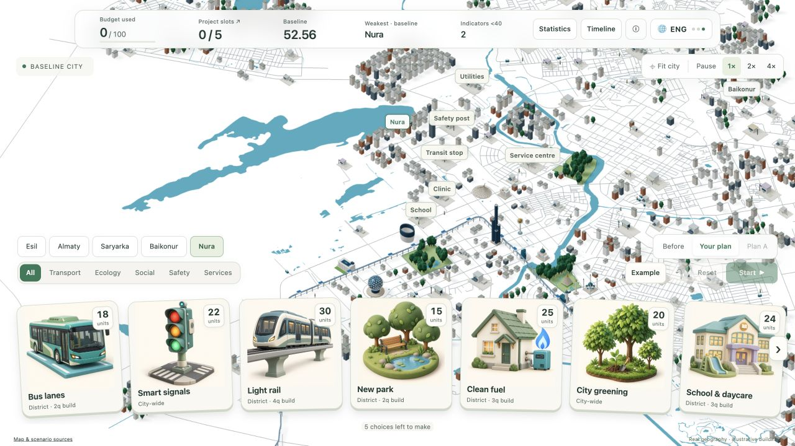
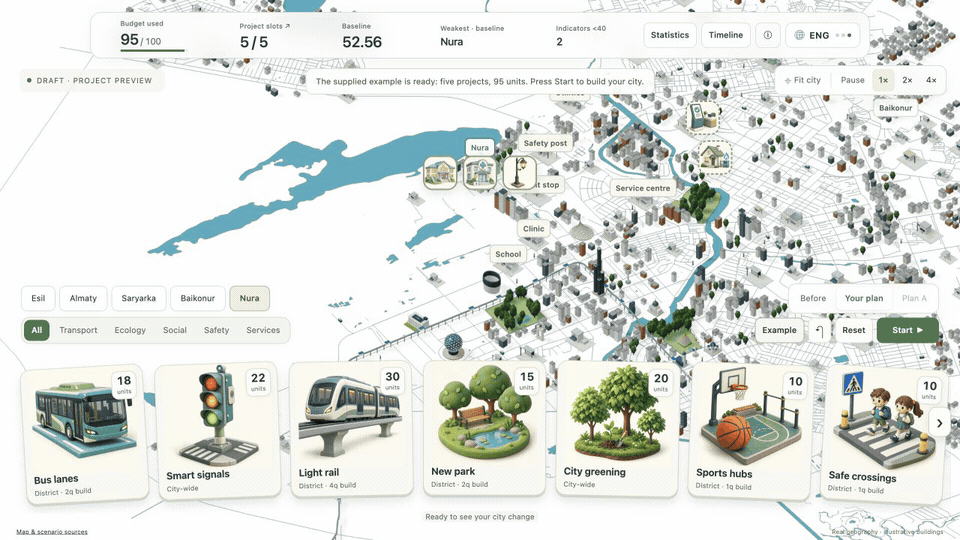

# Akim Lab

**A small city simulator for people who care about their city.**

HackAlem AI · Track 12: “Akim for 5 Hours” · Built by Nartay Aikyn

Choose five projects. Spend a budget of 100. Watch a miniature Astana change, compare the results, and try a different plan.



## Why we built it

People care about their neighborhoods: the school nearby, the road to work, the park where their children play. We wanted to give ordinary citizens an easy way to explore what they would improve in a city they love.

The design is intentionally simple. You choose illustrated cards, place projects on the map, and see what changes. A small set of numbers shows the result; details are there when you want them. Familiar buildings, moving people and small reactions make the city feel alive and make it inviting to try another idea.

Our aim is to make participation feel approachable. You can experiment, see the trade-offs of a limited budget, and think about how a choice helps one neighborhood or the wider city. The current app is a simulation for learning and discussion; it does not submit proposals to the government.

## See it in action



*Recorded from the app. Construction and reactions illustrate the projects; the official score is calculated at the end of quarter 8.*

## Run locally

Requires **Git and Node.js 22+**. Clone the team repository, then start the server. No package install or build step is needed.

```sh
git clone https://github.com/BAITC-Hacks/hack-9760174d-quasaruins.git
cd hack-9760174d-quasaruins
node server/main.mjs
```

Open **http://localhost:3000**. `npm start` also works. To use another port, run `PORT=3001 node server/main.mjs`. There is no hosted demo URL; this version runs locally.

The simulation and map work offline. For the live AI adviser, copy `.env.example` to `.env` and add your `OPENAI_API_KEY`. The default model is `gpt-5.4-mini` with low reasoning effort. Keep the key out of Git and browser code. Without an available AI service, the app shows a clearly labeled explanation based on the same calculations.

## How to play

1. **Choose projects.** Drag cards onto a district. City-wide projects apply across the five modeled districts.
2. **Adjust your plan.** Drag a placed card back to the hand to remove it. Invalid choices return to the hand with a reason.
3. **Build your city.** Choose exactly five projects within the budget, then press **Start**. Watch construction or use the speed controls.
4. **Compare the result.** Check the score and weakest district. Pin a result as **Plan A**, change your choices, and compare.
5. **Explore an improvement.** Ask for a verified project swap or an AI explanation of the benefits and trade-offs.

For a quick test, click **Example → Start**. Expect cost **95**, an **Astana Quality of Life Score of 56.54**, and **zero critical indicators**. Choose **Find one improvement → Apply verified change** to reproduce cost **100** and score **57.21**. Try adding a sixth project to see a rejected choice with an explanation.

Drag the map to pan, right-drag to rotate, and scroll to zoom. **Fit city** resets the view. Click and keyboard controls are also available. The language button cycles **Kazakh, Russian and English**; AI briefings and narration are English in this version.

## What is included

| Part | What you can do |
| --- | --- |
| Miniature Astana | Explore mapped districts, landmarks, parks and roads. |
| 14 project cards | Choose transport, ecology, social, safety and utility projects. |
| Visible changes | See construction, upgraded buildings, trees, road treatments and rail. |
| Clear results | Compare plans, inspect district scores, export JSON or print a report. |
| Verified advice | Review a fully calculated improvement before applying it. |
| Grounded AI | Get an explanation based on the simulation's verified results. |

## How the results work

The app follows the challenge's fixed dataset and formulas: **five unique projects, a 100-unit budget, and at most two projects per category**. Project delays, negative effects, synergies and incompatibilities all count. The score considers the city average, the weakest district and indicators below 40.

The simulation calculates every number. AI helps explain the results. The improvement search checks all valid single-project replacements and preserves any projects you lock; it does not claim to find the best possible five-project plan.

Astana's real geography is the backdrop. The challenge supplies **five synthetic districts**, while the real city has six. Sarayshyk appears on the map without an invented score. Buildings, construction and resident reactions are illustrative. This is a learning tool, not a forecast of real policy outcomes.

## Technical details

Built with **Node.js, JavaScript, HTML/CSS and Three.js**, with the OpenAI Responses API for the optional adviser. Optional narration uses OpenAI's `gpt-4o-mini-tts` model, with browser speech as a fallback. Map data and Three.js are included locally.

The main components are:

- `public/`: cards, controls, translations and the 3D city.
- `shared/`: the dataset, scoring rules and single-project improvement search.
- `server/`: HTTP endpoints, validation, AI evidence and narration.
- `data/`: cached map geometry; `tests/` and `test/acceptance/`: automated checks.

The browser sends a plan to the server. The shared model validates and scores it. The adviser receives those verified results, and the browser shows the city changes and final report.

```sh
node --test
python3 test/acceptance/oracle.py
```

The automated checks cover the official calculation, invalid plans, recommendations, HTTP endpoints and AI boundaries. An independent Python implementation checks the reference results.

## Data and limitations

The scoring data comes from the organizer's Track 12 **“Датасет районов”** and is stored in `shared/city-data.js`. Map geometry comes from Astana's public geoportal and OpenStreetMap, with source links in [data/README.md](data/README.md). The only live external service is OpenAI for optional advice and narration; maps do not require a live map API.

Plans are saved in the current browser. Shared accounts, cross-team leaderboards, unexpected city events and automatic slide generation are not implemented. The map is illustrative, the scoring data is synthetic, and AI explanations and narration are currently English-only.

Possible next steps are community proposal comparison, uncertainty ranges for project effects, and testing the interface with residents. These are future ideas, not current features.

## More detail

- [Model, AI and architecture](docs/TECHNICAL.md)
- [Short demo guide](docs/DEMO.md)
- [Map sources and limitations](data/README.md)
- [Project artwork and prompts](docs/PROJECT-ART.md)
- [Interface contract](docs/CONTRACT.md)
- [Organizer README checklist](docs/README-CHECKLIST.md)

## Participant and AI tools

**Nartay Aikyn is the sole human participant and project lead.** Codex-A supported planning, backend, simulation and integration. Codex-B supported the frontend and city interaction. Claude supported landmarks, scenery, translations, tests and review. Image generation produced the project card artwork. These are AI tools used by one participant.

The app itself uses AI for the optional grounded adviser and narration. The simulation and scoring remain deterministic.
